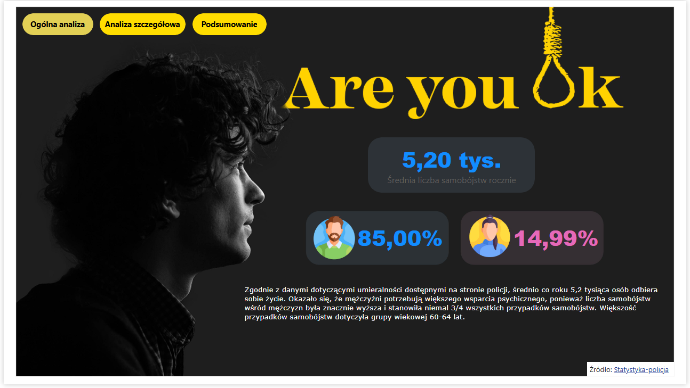
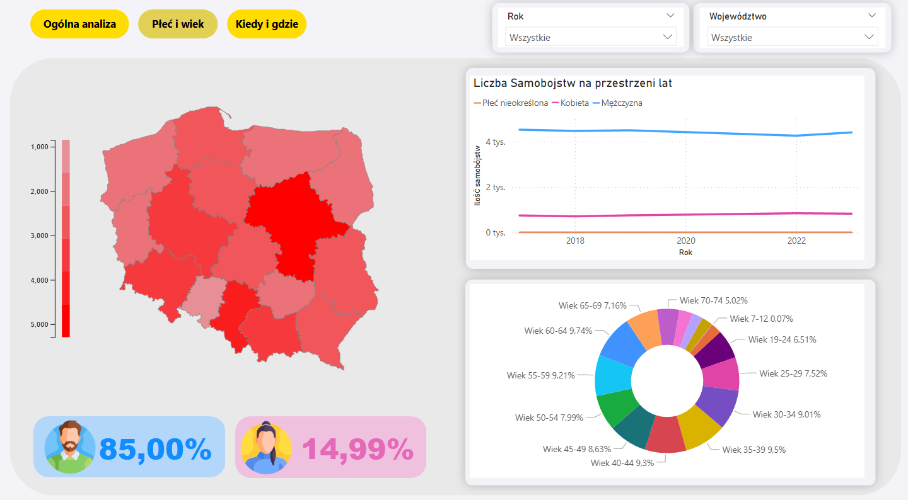
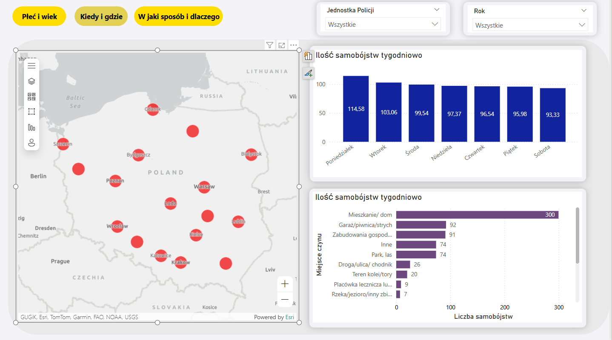
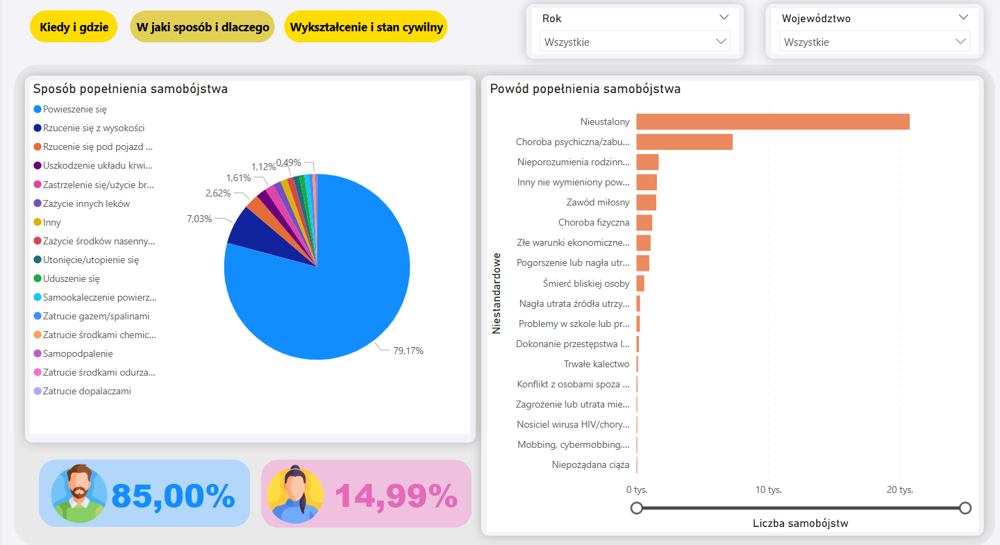

# Analiza danych dotyczących samobójstw w Polsce (2017-2023)

## Opis
Projekt ma na celu analizę danych dotyczących samobójstw w Polsce w latach 2017-2023, uwzględniając zmienne demograficzne, społeczne i zdrowotne. Celem jest zrozumienie kluczowych czynników wpływających na liczbę samobójstw oraz identyfikacja wzorców, które mogą pomóc w profilaktyce samobójstw. Projekt wykorzystuje narzędzia Power BI, w tym DAX, Power Query oraz funkcje AI do prognozowania i wykrywania anomalii. Stworzono interaktywny dashboard, który umożliwia dynamiczną analizę danych i wspiera podejmowanie decyzji.

## Zakres projektu
- **Analiza demograficzna**: Badanie liczby samobójstw w różnych grupach wiekowych oraz w zależności od płci.
- **Analiza społeczna**: Analiza wpływu stanu cywilnego, wykształcenia, źródła utrzymania i innych zmiennych społecznych na ryzyko samobójstwa.
- **Analiza geograficzna**: Mapowanie samobójstw w Polsce z podziałem na województwa.
- **Analiza metod i przyczyn**: Przeanalizowanie najczęstszych przyczyn i metod popełniania samobójstw.
- **Prognozowanie**: Predykcja liczby samobójstw w przyszłych latach na podstawie danych historycznych.
- **Wykrywanie anomalii**: Zastosowanie zaawansowanych funkcji AI w Power BI do wykrywania nietypowych wzorców w danych.

## Technologie
- **Power BI**: Narzędzie do analizy danych i tworzenia wizualizacji.
- **Power Query**: Do importowania i przekształcania danych z różnych źródeł (plików Excel).
- **DAX**: Do tworzenia miar i obliczeń w modelu danych.
- **AI w Power BI**: Narzędzia do prognozowania i wykrywania anomalii w danych.

## Dane
Projekt oparty jest na danych dostarczonych przez KWP, zawierających szczegółowe informacje o samobójstwach w Polsce w latach 2017-2023, w tym:
- Liczba samobójstw według województw.
- Demograficzne szczegóły ofiar (wiek, płeć, stan cywilny, wykształcenie, źródło utrzymania).
- Miejsce i sposób popełnienia samobójstwa.
- Przyczyny samobójstw (np. choroby psychiczne, problemy rodzinne).

## Wyniki
- Interaktywny dashboard umożliwiający analizę liczby samobójstw w różnych województwach i grupach demograficznych.
- Wizualizacje przedstawiające zależności między płcią, wiekiem, stanem cywilnym, wykształceniem, źródłem utrzymania i liczbą samobójstw.
- Prognozy dotyczące przyszłych trendów w liczbie samobójstw.
- Wykrywanie anomalii w danych

## Wnioski
Projekt dostarcza narzędzi do analizy danych o samobójstwach w Polsce, umożliwiając wykrywanie istotnych wzorców i trendów. Dzięki zastosowaniu narzędzi AI, możliwe jest prognozowanie przyszłych zmian w liczbie samobójstw oraz wykrywanie anomalii, co może wspomóc działania prewencyjne i profilaktyczne.

