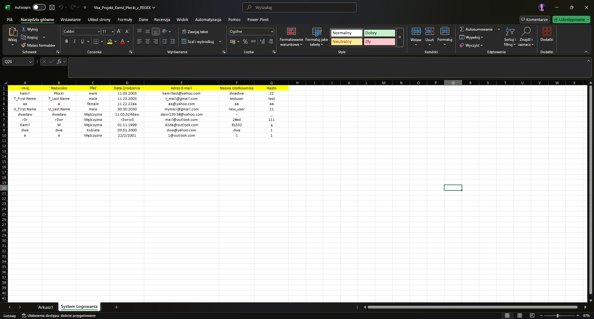

# System Logowania w VBA

Ten projekt został stworzony w ramach trzeciego semestru studiów. Jest to system logowania opracowany w VBA, wykorzystujący mechanizmy weryfikacji danych logowania (nazwy użytkownika, adresu e-mail i hasła) zapisanych w arkuszu programu Excel. Projekt zawiera również funkcjonalność rejestracji nowych użytkowników.

## Funkcjonalności

1. **Logowanie użytkownika:**
   - Logowanie za pomocą nazwy użytkownika i hasła.
   - Logowanie za pomocą adresu e-mail i hasła.
   - Dynamiczne komunikaty dla użytkownika (np. brak danych, błędne hasło).

2. **Rejestracja użytkownika:**
   - Możliwość rejestracji nowych użytkowników z wyborem płci i adresu e-mail.
   - Walidacja danych wprowadzonych przez użytkownika.

3. **Ukrywanie arkuszy:**
   - Arkusz "System Logowania" jest ukrywany po otwarciu pliku i staje się widoczny dopiero po poprawnym zalogowaniu.

4. **Dynamiczny interfejs użytkownika:**
   - Efekty wizualne, takie jak animowane wyświetlanie tekstu na ekranie logowania.
   - Automatyczne wypełnianie list rozwijanych na podstawie dostępnych opcji.

## Struktura projektu

Projekt składa się z kilku modułów i formularzy w VBA:

### Module1
- Funkcja `mail_address` generuje domeny e-mail na podstawie indeksu.
- Funkcja `LogRegister` sprawdza obecność użytkownika w bazie danych na podstawie nazwy użytkownika, adresu e-mail lub hasła.
- Funkcja `UkryjArkuszWarunkowo` kontroluje widoczność arkusza "System Logowania".

### Formularz `LoginSystem`
- Formularz obsługujący logowanie.
- Dwa tryby logowania: za pomocą nazwy użytkownika lub adresu e-mail.
- Walidacja danych i wyświetlanie odpowiednich komunikatów.

### Formularz `Login_Register`
- Formularz umożliwiający rejestrację nowych użytkowników.
- Walidacja danych wprowadzanych w polach tekstowych i listach rozwijanych.

### Formularz `Msg`
- Formularz obsługujący wyświetlanie komunikatów dla użytkownika.

## Przykładowe komunikaty

- **Logowanie:**  
  - „Podaj swoją nazwę użytkownika i hasło.”  
  - „Zalogowałeś się!”  
  - „Błędnie wprowadzone hasło.”  
  - „Nie znaleziono adresu e-mail.”

- **Rejestracja:**  
  - „Można wprowadzić tylko adresy z podanych opcji.”  
  - „Wybór ograniczony jest do płci z podanych opcji.”

## Wymagania

- Microsoft Excel z obsługą makr VBA.
- Znajomość podstaw VBA w celu edycji kodu, jeśli zajdzie taka potrzeba.

## Sposób działania

1. **Logowanie:**
   - Po uruchomieniu skoroszytu użytkownik widzi formularz logowania. Może wybrać logowanie za pomocą nazwy użytkownika lub adresu e-mail.
   - Dane logowania są sprawdzane w arkuszu "System Logowania". Jeśli są poprawne, użytkownik zostaje zalogowany.

2. **Rejestracja:**
   - Użytkownik może przełączyć się do formularza rejestracji i wprowadzić swoje dane.
   - Dane są walidowane przed zapisaniem w arkuszu.

3. **Ukrywanie arkuszy:**
   - Arkusz "System Logowania" pozostaje ukryty do momentu zalogowania się użytkownika.

## Zdjęcia i zrzuty ekranu

1. **Formularz logowania**  
   

2. **Formularz rejestracji**  
   

3. **Restartowanie hasła**
    

4. **Widok arkusza danych**  
   

5. **Komunikaty błędów**  
   